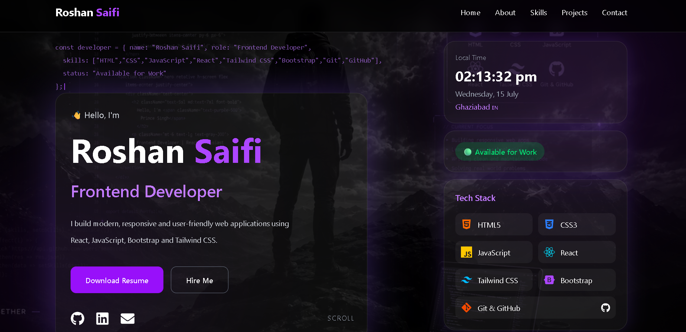

# 💼 Roshan Saifi - Frontend Developer Portfolio

A modern and responsive personal portfolio website built with **React**, **Vite**, and **Tailwind CSS**. This portfolio showcases my projects, technical skills, education, and contact information with a clean black & purple UI.

---

## 🚀 Live Demo

🌐 Live Website: https://updated-portfolio-nine-drab-77.vercel.app/

---

## 📸 Preview



---

## ✨ Features

- 🎨 Modern Black & Purple UI
- 📱 Fully Responsive Design
- ⚡ Fast Performance with Vite
- 🎬 Smooth Animations using Framer Motion
- 👨‍💻 About Me Section
- 💼 Projects Showcase
- 🛠 Skills Section
- 🎓 Education & Journey Timeline
- 📞 Contact Section
- 📄 Resume Download
- 🔗 GitHub, LinkedIn & Email Integration

---

## 🛠 Tech Stack

### Frontend

- React.js
- JavaScript (ES6+)
- HTML5
- CSS3
- Tailwind CSS
- Bootstrap

### Libraries

- React Icons
- Framer Motion

### Tools

- Vite
- Git
- GitHub
- VS Code
- Vercel

---

## 📂 Project Structure

```bash
src/
│
├── components/
│   ├── Hero/
│   ├── About/
│   ├── Skills/
│   ├── Projects/
│   ├── Timeline/
│   ├── Contact/
│   ├── Footer/
│   └── UI/
│
├── data/
│
├── styles/
│
├── App.jsx
└── main.jsx
```

---

## ⚙️ Installation

Clone the repository

```bash
git clone https://github.com/RoshanSaifi93/Updated-Portfolio.git
```

Go to project folder

```bash
cd Updated-Portfolio
```

Install dependencies

```bash
npm install
```

Start development server

```bash
npm run dev
```

Build for production

```bash
npm run build
```

---

## 📬 Contact

👤 **Roshan Saifi**

📧 Email: saifiroshan88@gmail.com

💼 LinkedIn:
https://www.linkedin.com/in/roshan-saifi-104619382/

🐙 GitHub:
https://github.com/RoshanSaifi93

---

## 📄 License

This project is open-source and available under the MIT License.

---

⭐ If you like this project, don't forget to give it a star on GitHub!